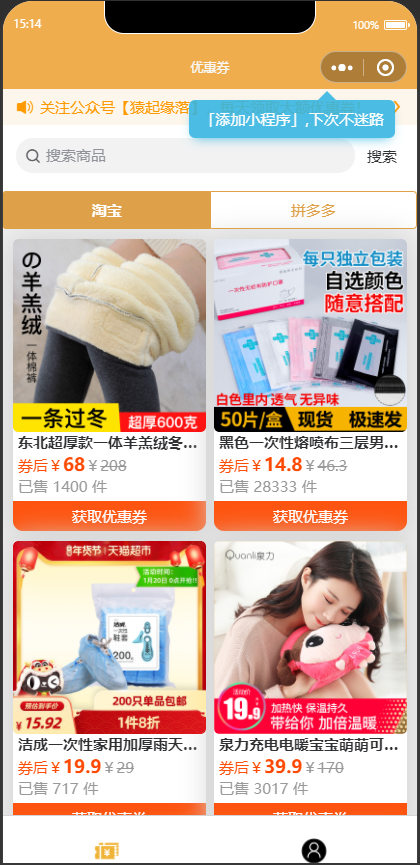
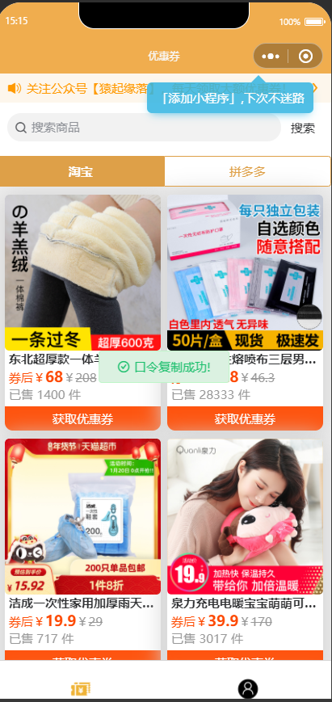
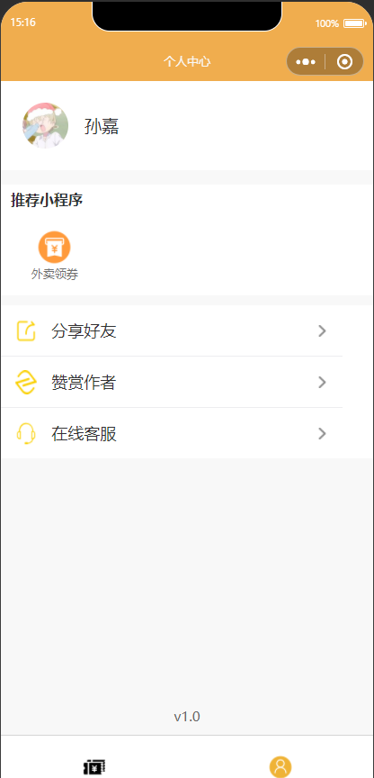

### 更新日志 20210122
- 改写云函数为flask后端代码（听说云函数开始薅羊毛了，不得不提前下手）
- 去除无用代码
- 
### 更新日志 20210110
- 初步整合拼多多和淘宝联盟优惠券API

### 图片示例




### 使用方法

`该小程序使用uniapp + flask开发。`


* 申请多多进宝应用，不做详细叙述，申请地址：[https://jinbao.pinduoduo.com/](https://jinbao.pinduoduo.com/)、[https://open.pinduoduo.com/](https://open.pinduoduo.com/)
* 淘宝联盟申请，[淘宝联盟](https://pub.alimama.com/)、[淘宝联盟开放平台](https://aff-open.taobao.com/developer/index.htm#/index)，具体申请方法自行百度
* 在微信开发者工具中导入项目`coupons-tk`文件夹，不用开启云开发。
* 修改`coupons-taoke-api/config.py`的拼多多和淘宝密钥配置。
* 安装python依赖环境`pip install -r requirements.txt`（我用的python3.7）
* 运行flask脚本`python app.py`
* 测试时设置`libs/request.js`中的apiUrl为`http://127.0.0.1:5000`,线上环境设置为自己的网址即可（注意测试时关闭微信开发工具中的合法域名校验）


### 其他问题

- 如果遇到领券 搜索接口报错，需要用这个[接口](https://jinbao.pinduoduo.com/third-party/api-detail?apiName=pdd.ddk.rp.prom.url.generate)对`pid`备案一次（进入这个接口网址前请先登录拼多多开放平台，API接口在打开链接后的网址最下面API测试工具），channel_type: 10。接口会返回以下格式的参数：

```json
{"rp_promotion_url_generate_response":{"url_list":[{"mobile_url":"xxxxx","url":"这里的URL"}],"request_id":"xxx"}}
```
- 登录上述的url，用你的账号授权一次。然后再访问该[接口](https://jinbao.pinduoduo.com/third-party/api-detail?apiName=pdd.ddk.member.authority.query)查询下是否备案成功，成功后就没权限问题。

### 本人已上线案例：


### 其他
- 如有其他疑问，请先关注微信公众号【猿起缘落】，查看历史教程文章
- 欢迎加作者微信【sunjiajis】，备注淘客源码。进群交流
- 如有打赏，帮你解决BUG的速度会更快哦

赞赏


微信


公众号


如有线上案例或疑问，请提issue，或者关注微信公众号【猿起缘落】
