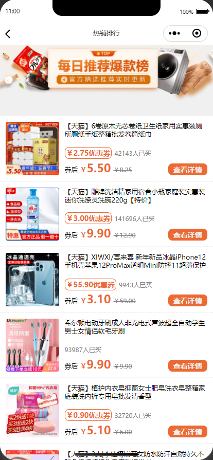
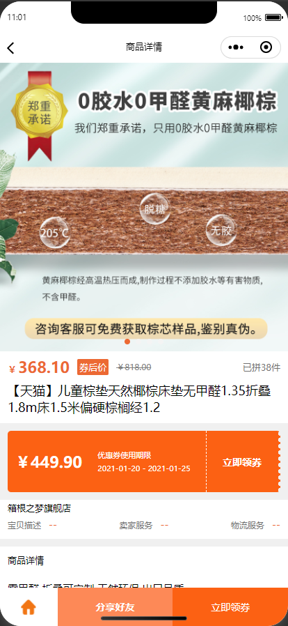
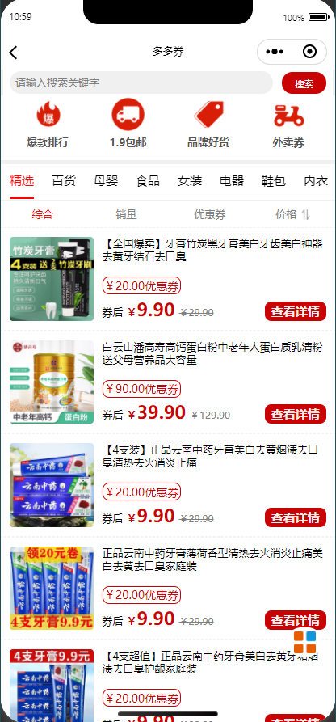
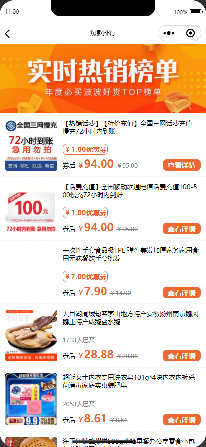
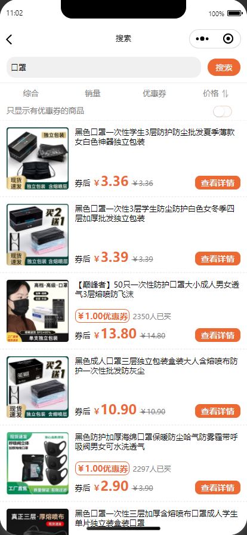
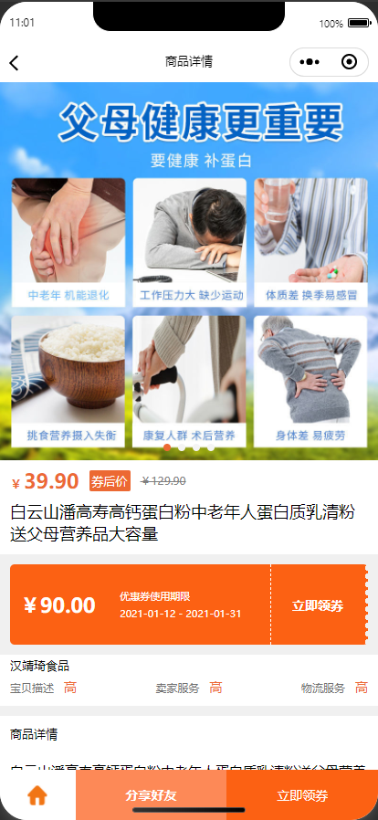
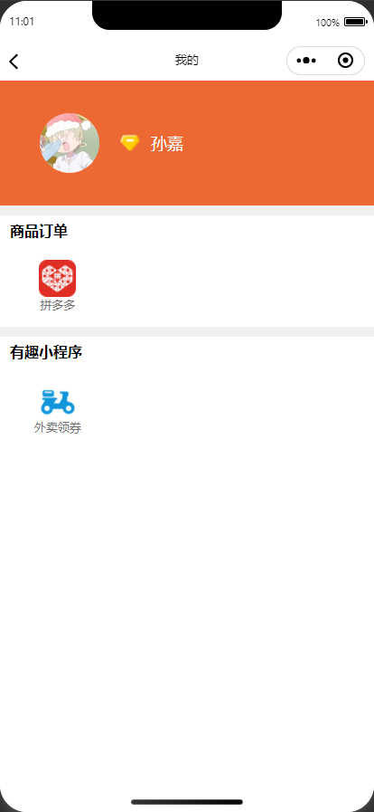

# 淘客小程序（该小程序使用微信原生+云函数开发）

- 本程序UI界面基于[pdd-coupon](https://github.com/sgxiang/pdd-coupon)项目改造
- 新增加淘宝联盟云函数

# pdd-coupon

### 一点有惠 —— 淘宝、拼多多领券小程序









### 使用方法

`该小程序使用微信原生+云函数开发。`

* 申请多多进宝应用，不做详细叙述，申请地址：[https://jinbao.pinduoduo.com/](https://jinbao.pinduoduo.com/)、[https://open.pinduoduo.com/](https://open.pinduoduo.com/)
* 淘宝联盟申请，[淘宝联盟](https://pub.alimama.com/)、[淘宝联盟开放平台](https://aff-open.taobao.com/developer/index.htm#/index)，具体申请方法自行百度
* 在微信开发者工具中导入项目`coupons-taoke`文件夹，并开启云开发。
* 修改`env.js`的配置。
* 修改`functions\pquery\utils\index.js`里拼多多相关的配置参数。上传云函数。

### 其他问题

- 如果遇到领券 搜索接口报错，需要用这个[接口](https://jinbao.pinduoduo.com/third-party/api-detail?apiName=pdd.ddk.rp.prom.url.generate)对`pid`备案一次（进入这个接口网址前请先登录拼多多开放平台，API接口在打开链接后的网址最下面API测试工具），channel_type: 10。接口会返回以下格式的参数：

```json
{"rp_promotion_url_generate_response":{"url_list":[{"mobile_url":"xxxxx","url":"这里的URL"}],"request_id":"xxx"}}
```
- 登录上述的url，用你的账号授权一次。然后再访问该[接口](https://jinbao.pinduoduo.com/third-party/api-detail?apiName=pdd.ddk.member.authority.query)查询下是否备案成功，成功后就没权限问题。

### 本人已上线案例：


### 其他
- 如有其他疑问，请先关注微信公众号【猿起缘落】，查看历史教程文章
- 欢迎加作者微信【sunjiajis】，备注淘客源码。进群交流
- 如有打赏，帮你解决BUG的速度会更快哦

赞赏


微信


公众号

